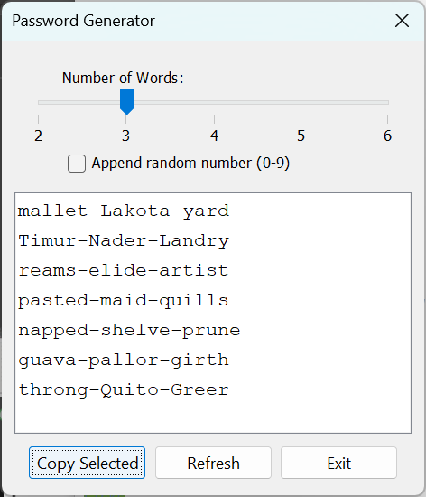

# An application to generate possible passwords

The file src/main/resources/word.txt is generated from linux /usr/share/dict/words like this:

    grep -E '^[a-z|A-Z]{4,6}$' /usr/share/dict/words > src/main/resources/words.txt

Licence GNU Public Licence 3 https://www.gnu.org/licenses/gpl-3.0.en.html
